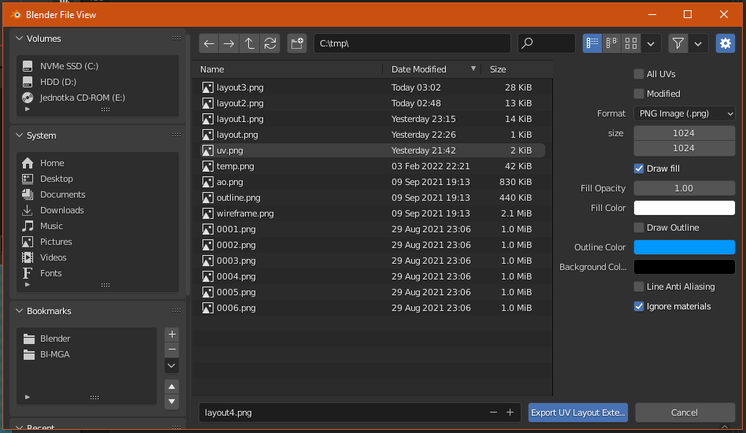

# Export UV Layout Extended
**Blender's Export UV Layout addon with additional settings**

This addon is just a simple modification of the Blender Export UV Layout operator.
These settings feel like that they should be included in the original addon itself.

## Features

- The same functionality as the Export UV Layout addon, but additionaly:
- Draw outline / fill only
- Set outline color, fill color and background color
- Ignore material diffuse colors (fill everything with a single color)
- Disable anti-aliasing

## Installation

> **NOTE**: The addon was tested on Blender 3.0.0+ but should be compatible with 2.8+

Can be installed like usual by installing the addons _.zip_ archive through the Blender preferences window.

The menu options appears where the regular Export UV Layout option is in `Image-Window > UVs > Export UV Layout Extended`. Export settings appear in the file chooser dialog.

## Downloads

Download `ExportUVLayoutExtended.zip` from [releases](https://github.com/xDUDSSx/export-uv-layout-extended/releases).  
Alternatively you can zip the `ExportUVLayoutExtended` folder yourself after cloning the repo.